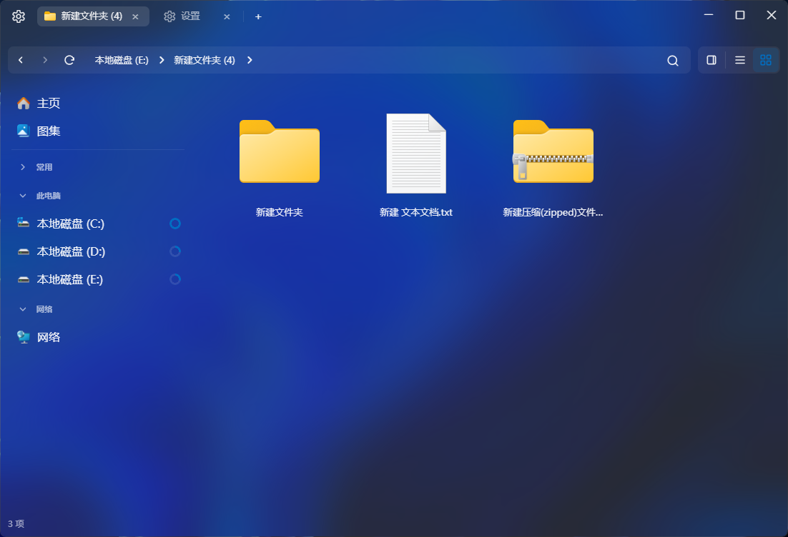

<div align="center">
  <table width="100%">
    <tr>
      <td align="right"><a href="./README-zh_CN.md">简体中文</a></td>
    </tr>
  </table>
</div>

<p align="center">
  
</p>

# FileMgr

FileMgr is a desktop file manager built with **Tauri 2** and **Vue 3**, aiming to provide a lightweight, smooth, and modern file browsing experience on Windows.

## Source Availability

This repository is published as **backend-only** (Rust backend + Tauri shell). Frontend sources and Node/Vite project files are intentionally not included.

## Features

- Multi‑tab file browsing, allowing multiple locations in one window  
- Explorer‑like file list view with sorting, hidden/system file toggle, and more  
- Context menus that closely mimic native behavior  
- Sidebar with quick access to common locations (This PC, Downloads, Pictures, etc.)  
- Built‑in Settings page for tuning:
  - Theme mode and accent color
  - Window visual effects
  - List row gap and background appearance
  - Search behavior (e.g., whether Enter is required)
- Rust backend for filesystem access and performance‑sensitive operations

> UI and interactions may evolve; refer to the running app for the most up‑to‑date behavior.

## Requirements

- OS: Windows 10/11 (desktop)  
- Rust: stable toolchain (for building `rust-backend/` and `src-tauri/`)  
- Node.js: 18+ (only required when you have the frontend sources locally)  

## Backend Development (Rust)

Build:

```bash
cd rust-backend
cargo build
```

Run (if the backend crate provides a runnable binary):

```bash
cd rust-backend
cargo run
```

Test:

```bash
cd rust-backend
cargo test
```

## Desktop App (Tauri) Dev & Build

The desktop app requires frontend assets. If you have the frontend sources locally, run in the repository root:

```bash
npm install
npm run dev
```

Production build/installer:

```bash
npm run build
```

> Before building, ensure that the Rust toolchain and Windows dependencies required by Tauri are properly installed, according to the official Tauri documentation.

## Project Structure (Overview)

- `rust-backend/`: Rust backend crate (filesystem and related logic)  
- `src-tauri/`: Tauri configuration and shell project  
- `LICENSE`: Apache License 2.0  

Frontend sources (e.g. `src/`, `package.json`, `vite.config.js`, `dist/`) are not included in this repository.

Actual layout may evolve as the project grows.

## License

This project is released under the **Apache License 2.0** as stated in [LICENSE](./LICENSE).

